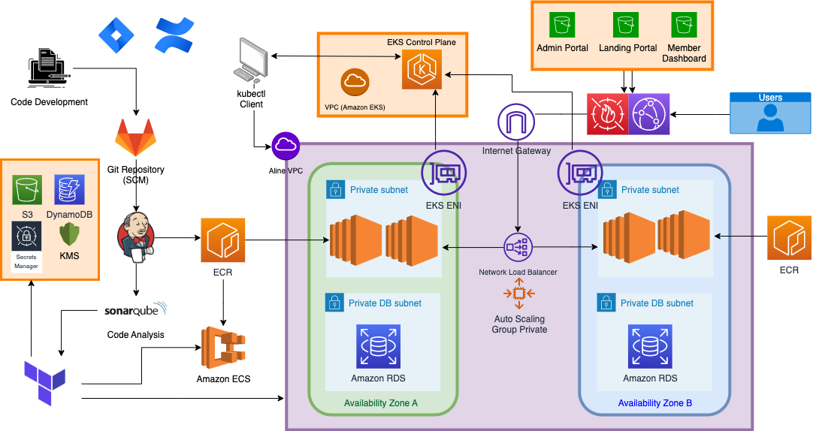

# Aline Financial

## Usage

Aline Financial is an online banking platform that utilizes the power of the AWS Cloud to deliver a seamless and secure user experience. The platform is composed of multiple microservices and user interface components that handles member applications, credit-line underwriting, etc. This allows customers to easily register for accounts, apply for lines of credit, and conduct financial transactions. 

### Aline Financial App Architecture:

## Source files
This repo contains Terraform resource files for the Aline Banking Application. 

## Support

lynda.foster@smoothstack.com 
[Cyber Cumulus Jira](https://cyber-cumulus-smoothstack.atlassian.net/jira/software/projects/CC/boards/1)

## Roadmap

[Aline DevOps repo](https://git1.smoothstack.com/cohorts/2022/organizations/cyber-cumulus/lynda-foster/aws-cicd) - Check the devlop branch for completed features.

- [x] Cloud Containerization

    - [x] Kubernetes Cloud - EKS
    - [x] Docker-Compose Cloud via ECS

- [x] Jenkins CI/CD
Our Jenkins distributed environment and SonarQube server is runs on 2 EC2 instances on AWS.  
    - [x] Jenkins Pipelines for Microservices
        - Multi-branch pipelines with a [Class Library](https://git1.smoothstack.com/cohorts/2022/organizations/cyber-cumulus/lynda-foster/lib-aline).
        - Push and Merge triggers via Jenkins Integrations webhook on GitLab. 
    - [x] Jenkins Integration with SonarQube
        - Tests and Quality Gates for each Maven and Node applications implemented. 
    - [x] [Docker-Compose](https://github.com/lfost42/aline-cicd) via Jenkins
    - [x] [Kubernetes](https://github.com/lfost42/aline-cicd) via Jenkins
    - [x] [Terraform](https://github.com/lfost42/aline-dev-infra) Plan and Apply via Jenkins

- [x] [Terraform CI/CD](https://github.com/lfost42/aline-dev-infra)
    - [x] Architect Base Infrastructure
    - [x] Create Base Infrastructure
    - [x] TFLint
    - [x] Terratest
    - [x] Terraform Associate Certificate

- [x] General CI/CD
    - [x] [Ansible](https://github.com/lfost42/aline-dev-infra) Playbooks
    - [x] Vanilla [CloudFormation](https://github.com/lfost42/aline-dev-infra) Templates
 
## Acknowledgements
Lead Developer:

[Lynda Foster](https://github.com/lfost42)

With support from the Cyber Cumulus Team:

[Nathan Galler](https://git1.smoothstack.com/nathan.galler) 
[Sebastian Marzal](https://git1.smoothstack.com/sebastian.marzal)

## License
[MIT License](LICENSE)