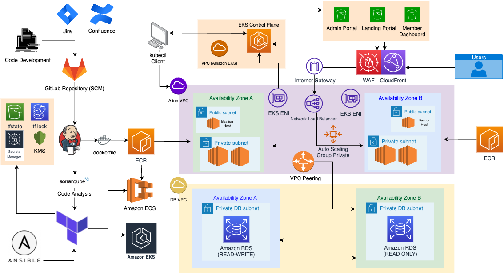

# Aline Financial

## Usage

Aline Financial is an online banking platform that utilizes the power of the AWS Cloud to deliver a seamless and secure user experience. The platform is composed of multiple microservices and user interface components that handles member applications, credit-line underwriting, etc. This allows customers to easily register for accounts, apply for lines of credit, and conduct financial transactions. 

### Aline Financial App Architecture:

## Source files
This repo contains Terraform resource files for the Aline Banking Application. 

## Terraform Demo Info

By the time my team was ready to adapt Terraform into our CI/CD pipeline, we were eager to extend our capabilities to consistently and efficiently operate and manage our infrastructure running in the cloud. 

#### Security
When designing a base infrastructure to be highly available, fault-tolerant, and flexible enough to accommodate growth, security was a major consideration. To address this, we established separate subnet groups for the private, public, and database resources. We implemented access restrictions from the public internet. 

To ensure that only authorized users or applications can connect to the database and microservices, we used security groups and policies that implemented the principle of least privilege. This separation of concerns significantly reduces the risk of attacks and ultimately improves the overall stability and reliability of the application. 

#### VPC
Much of our scaling challenges were addressed in the implementation of our VPC module. We utilized the cidrsubnet function with the appropriate index and cidr bits to accommodate our subnet groups to scale up to 5 availability zones. We also adjust the index value based on the number of availability zones to adapt to whatever count we set it to. 

#### Scalability
In terms of directory structure, we took a modular approach. This allowed resources that are shared by both the ECS and EKS deployment to be used without the need to refactor or duplicate code. In the environments directory, each application combines a set of child modules to make up a more holistic solution. This is accomplished using outputs, which are propagated from the child modules up into the root deployments. The extensible nature allows us to add new resources or update existing ones without disturbing or having to rewrite the overall architecture of the solution. It also provides consistency, follows best practices, and makes the code easier to manage and maintain over time. 

Our tfvars file provides us with the flexibility to scale or modify the default configuration of our application. This includes the ability to scale individual components up or down as needed. We can also modify the node properties of our cluster to adjust the scale of our nodes or change the type of our AMI (amazon machine image). By leveraging the tfvars file, we are able to make changes quickly and efficiently, without the need for significant manual intervention. 

#### Work Flow
One of the challenges of working with modules was the work flow in itself in navigating to the appropriate directory to run various terraform tasks. This led to the development of two bash scripts that reduced my back and forth to only the AWS and environment directories.   

#### RUN SCRIPT
For the environment directory, I have a run script and I called terraform output earlier. This one allows me to pass in the environment [deploy] and application directory [aline-eks-app] followed by the terraform command `let say stay state list`, and it will pass in access the root directory and backend configuration state files which are stored centrally on s3 buckets with dynamodb locking. This shows a list of the current resources in this deployment. 

### Lint Scripts
In the AWS directory, I have a lint script that runs tflint and terraform format in both the environment and module directories. This is something I use frequently to ensure I am following best practices and maintain the quality as well as readability of my code. It also helps prevent minor issues from building up over time. Finding the issue is a matter of clicking the link that proceeds the issue, following the recommendation, and rerun `./lint`. 

Both scripts are set up to capture the exit code to ensure that any failures caused by running either script are propagated to the Jenkins pipeline. This allows us to quickly identify and address any issues that arise during the development process. 

### Pipeline
Knowing that Jack was going to run his pipeline live, I went ahead and ran this ahead of time. Terraform Apply is set to only run on merges to the Main branch since Infrastructure isn’t something we want to change until it is ready for production. 

To conform to various compliance standards, this step requires administrative approval as shown here. When infrastructure changes are approved, an email confirmation is triggered. The email includes the pipeline name, build, person who authorized the change, as well as the git commit hash connected to the change. This helps maintain a clear audit trail and improve the traceability across our development process. 

## Roadmap

- [x] Cloud Containerization
    - [x] Kubernetes Cloud - EKS
    - [x] Docker-Compose Cloud via ECS

- [x] Jenkins CI/CD
Our Jenkins distributed environment and SonarQube server is runs on 2 EC2 instances on AWS.  
    - [x] Jenkins Pipelines for Microservices
        - Multi-branch pipelines with a [Class Library](https://git1.smoothstack.com/cohorts/2022/organizations/cyber-cumulus/lynda-foster/lib-aline).
        - Push and Merge triggers via Jenkins Integrations webhook on GitLab. 
    - [x] Jenkins Integration with SonarQube
        - Tests and Quality Gates for each Maven and Node applications implemented. 
    - [x] [Docker-Compose](https://github.com/lfost42/aline-cicd) via Jenkins
    - [x] [Kubernetes](https://github.com/lfost42/aline-cicd) via Jenkins
    - [x] [Terraform](https://github.com/lfost42/aline-dev-infra) Plan and Apply via Jenkins

- [x] [Terraform CI/CD](https://github.com/lfost42/aline-dev-infra)
    - [x] Architect Base Infrastructure
    - [x] Create Base Infrastructure
    - [x] TFLint
    - [x] Terratest
    - [x] Terraform Associate Certificate

- [x] General CI/CD
    - [x] [Ansible](https://github.com/lfost42/aline-dev-infra) Playbooks
    - [x] Vanilla [CloudFormation](https://github.com/lfost42/aline-dev-infra) Templates

## Second Breakfast Team
[Lynda Foster](https://github.com/lfost42)
[Krushil Naik](https://github.com/krushilnaik) 
[Jack Vogt](https://github.com/jwvogt) 
[Chloe Bradley](https://www.linkedin.com/in/chloe-bradley-978272251/)

## License
[MIT License](LICENSE)